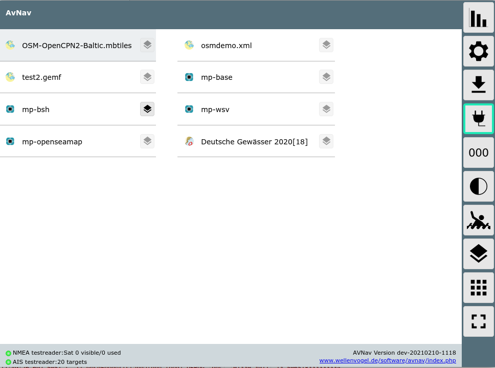
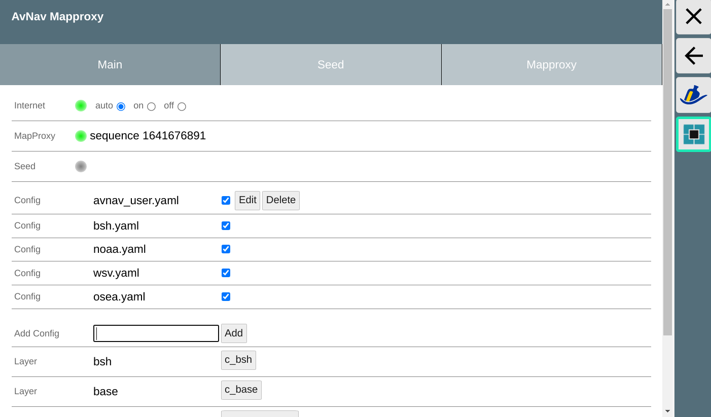
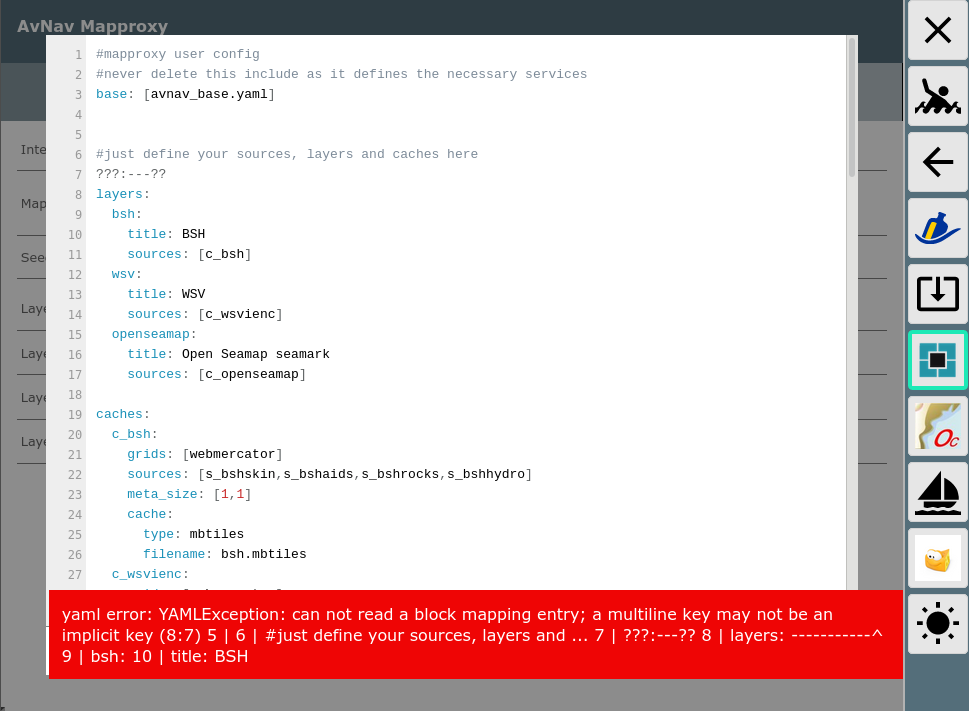
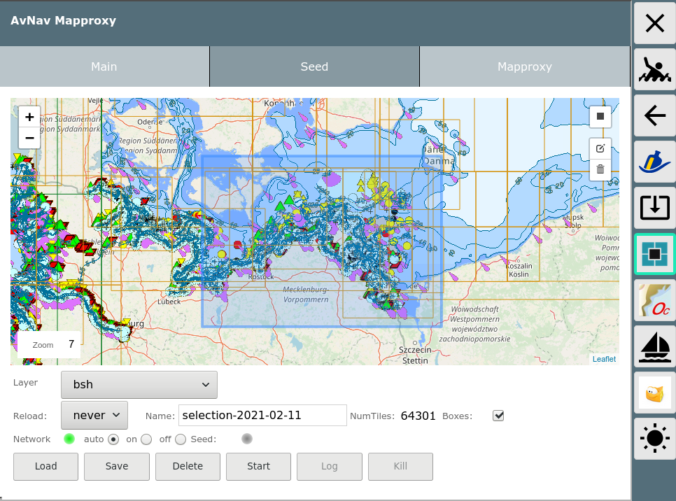
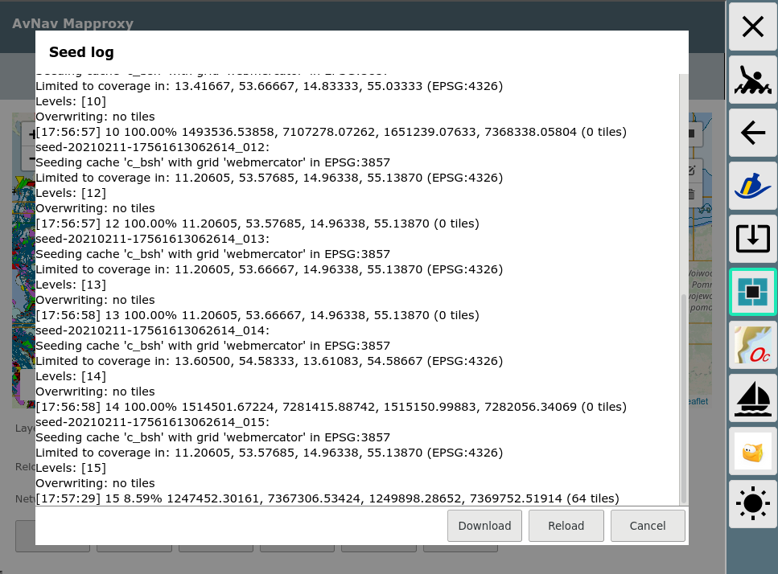
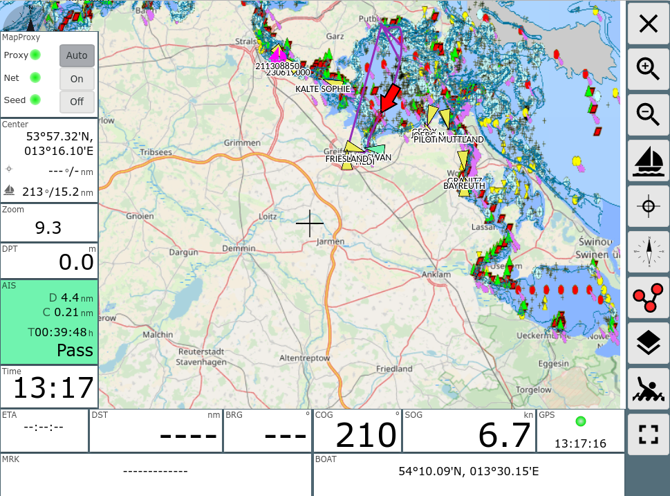

AvNav Mapproxy Plugin
=====================

This plugin for [AvNav](https://www.wellenvogel.net/software/avnav/docs/beschreibung.html?lang=en) 
allows you to use [MapProxy](https://mapproxy.org/) as chart provider for AvNav.
Additionally it supports you in setting up a configuration to "seed"  the caches in MapProxy
(i.e. download the necessary chart data).

MapProxy allows you to connect to various chart sources on the net and has a lot of built in 
cache and conversion functions.
It can be configured in a very flexible way to adapt to your needs.
This plugin will automatically install MapProxy and will provide a basic configuration for it.
It will integrate all [layers](https://mapproxy.org/docs/nightly/configuration.html#layers) that have been configured at MapProxy as charts in AvNav.



Additionally it will provide a [UserApp](https://www.wellenvogel.net/software/avnav/docs/userdoc/addonpage.html?lang=en)
that allows to control and supervise mapproxy.
There will be 2 new widgets that you can integrate on your pages to have a quick view at the 
MapProxy status.
MapProxy itself will not run as a separate process but directly inside AvNav (except for seeding - see below).
You can check the status of the plugin at the [status page](https://www.wellenvogel.net/software/avnav/docs/userdoc/statuspage.html).

UserApp
-------


On the "main" tab you can check the status of your internet connection ("Internet"), 
the status of MapProxy (if it has been initialized successfully) and if there is currently
a seed process running.
You can also download the cache files here (if you configured them to by in mbtiles format - see below). 
Those cache files can be used as charts on another AvNav instance (e.g. on the Android App).

*Hint*: The mbtiles files are in xyz format - so you need to [set this](https://www.wellenvogel.net/software/avnav/docs/userdoc/downloadpage.html?lang=en#h3:Charts-mbtilesFormat)
 explicitely in AvNav when you upload them to another instance.

__Configuration__

With the "config" button you can open an editor for the config file.
All the mapproxy related data will be in directories below /home/xxx/avnav/mapproxy
or /home/pi/avnav/data/mapproxy.
There are 2 config files:
   * avnav_base.yaml<br>
     This file is overwritten on every start - you should not change it.   
   * avnav_user.yaml<br>
     This is the file for your configuration.

Whenever you changed your configuration the plugin will combine both configurations
and write them to avnav_user.yaml.normal or avnav_user.yaml.offline.     
   
The config file editor provides some syntax highlighting and some checks for the yaml
based config files - see [MapProxy Configuration](https://mapproxy.org/docs/nightly/configuration.html)


You should follow some rules when setting up the configuration (most of them are just recommendations:
   * for each chart you would like to see in AvNav just set up a [layer](https://mapproxy.org/docs/nightly/configuration.html#layers)<br>
   * configure exactly one [cache](https://mapproxy.org/docs/nightly/configuration.html#caches) for each layer, name it the sam as the layer with a "c_" in front.
   * Always use "webmercator" as grid for the cache
   * use the [mbtiles](https://mapproxy.org/docs/nightly/configuration.html#format) format for the cache and use the name of the layer as filename
   * for the [sources](https://mapproxy.org/docs/nightly/sources.html) you need to find the necessary configuration from their description<br>
     Just check the provided [avnav_user.yaml](avnav_user.yaml) for examples.
   * for tile sources wie have 2 grids: osm_grid_xyz with y=0 in the north and osm_grid_tms with y=0 in the south 
        
If you are going to add a new source you have to make the following changes in the configuration:
   * add a new layer
     ```yaml
     mytest:
       title: My Test Chart
       sources: [c_mytest] 
     ```
   * add a cache
     ```yaml
     c_mytest:
       grids: [webmercator]
       sources: [s_mytest]
       meta_size: [1,1]
       cache:
         type: mbtiles
         filename: mytest.mbtiles
       
     ```  
   * add the source itself
     ```yaml
     s_mytest:
       req: 
         layers: 'Blattschnitte,IENC'
         transparent: true
         url: 'https://atlas.wsv.bund.de/ienc/wms?'
       supported_formats: [png]
       supported_srs: ['EPSG:4326']
       type: wms
       wms_opts: {version: 1.1.1}
     ```  
When you finished editing the config file you can do some yaml syntax checks using "Check".



The same check will be run again when you click "Save". Afterwards MapProxy will check
the configuration for it's content.
If an error will be found it will be reported in the status.


You will get a hint about the problem. Just edit your config and try again.
It is a good idea to download the configuration from within the editor 
(especially when opening it for the first time). This way you would always
have a working version and could use copy and paste to restore it later.

__Internet__

Normally for it's basic function MapProxy needs internet connectivity. 
But under way this will not always be available, of course...

As mapproxy has the great caching feature you can still use all the chart data you already have in the cache.
To be able to test this you can configure if mapproxy should use the internet or not.
Normally this mode will be "auto". The plugin will check every minute for a server (www.wellenvogel.de) 
for availability and will report the network status.
You can overwrite this with switching to "on" or "off". This setting will remain
valid till the next restart of AvNav.
When switching to "off" you can test (in AvNav or on the seed tab) if you already
have sufficient data in the caches.
The MapProxy configuration will be changed to ["seed_only"](https://mapproxy.org/docs/nightly/sources.html#seed-only) for all sources
if the network is not available.

Seeding
-------
[Seeding](https://mapproxy.org/docs/nightly/seed.html) is a function of MapProxy to (pre-)fill it's caches.
The plugin will support you in creating an appropriate configuration.


On the seed tab you can select an area on the chart that you would like MapProxy
to include for seeding.

As it is typically not possible to download large areas (like in the example) on
very high zoom levels (like 17 or 18) - but on the other hand you need such high zoom levels
for particular areas -  we integrated a set of "boxes". Thanks to [free-x](https://github.com/free-x/mbtiles-nautical-boxes/tree/contrib/iho/contrib/iho)
we have a large set of boxes as they are used for nautical charts. Whenever you
select a region on the map, the plugin will use the boxes inside this region to compute
the seed regions for mapproxy.

You start creating a selection by clicking the square in the upper right corner of the map.
An existing selection can be modified or deleted.
 
You can add more boxes as they are needed. Whenever you added or modified a selection
the plugin will compute an approximate for the amount of tiles that would be loaded 
into the cache.
 
It will mark this number in red if you exceed a configured limit (default: 200000) - 
and it will refuse to start the seed.

You can save your selection at the server using the name from the name field and you can load or delete 
stored selections.

With "Upload" and "Download" you can load and save the current selection from/to a file on your local system. 
On the "Layer" dropdown you can decide which layer you would like to see (and prepare for seeding).
At "Reload" you can decide if you would like to re-download tiles that are already in the
cache.

When clicking "Start" the seeding process will begin.
You can show the log (last ~100000 characters).



With "Kill" you will stop a running seed.

If you switch of the network the seeding will pause and will continue if the network is back again.
A restart of your system (or of AvNav) will also shortly pause the seed but it will restart.

If you find that the seeding will not cover an area you really need you still can
simply navigate on the map into this area, zoom as you need - and the caches will be filled
on the fly.

By switching the network to "off" you can check if you already have sufficient data
in the caches.

Widgets
-------
The plugin provides 2 widgets that you can add to your pages.
   * mpControlWidget
   * mpStatusWidget

.

With the mpControlWidget you will get the current status of Mapproxy and you can switch
the network mode.
The status widget is similar but without the ability to switch the network state.

AvNav Configuration
-------------
Normally there is no need for you to configure anything in the avnav_server.xml.
The following parameters can be set:
```
<AVNPluginHandler>
<system-mapproxy chartQueryPeriod="5".../>
```
Name | default| Description
-----|--------|------------
dataDir | $DATADIR/mapproxy | the directory for all the mapproxy related data
chartQueryPeriod | 5 | time in seconds before checking/querying the mapproxy config 
maxTiles |  200000 | the maximum number of tiles being allowed for seeding
networkMode | auto | the network mode being set when AvNav is starting
checkHost | www.wellenvogel.de | the hostname used for checking of network availability

Advanced Features
-----------------
In addition to the normal source configurations suppoerted by MapProxy the plugin
provides the ability to plug in some python code before and after a request is made
to a particular source.
This requires some programming know how and deep knowledge about the requirements
a source has.
You would configure at the source:
```yaml
s_pluginexample:
    type: tile
    grid: osm_grid
    url:  http://t1.openseamap.org/seamark/%(z)s/%(x)s/%(y)s.png
    transparent: true
    plugin: pluginexample.py

```
Additionally you need to put a file 'pluginexample.py' in the mapproxy directory (/home/pi/avnav/data/mapproxy).
Within this file you can implement 2 methods:
```python
def prepareRequest(url,headers):
    print("###prepareRequest for %s"%url)
    if '?' in url:
        return url+"&t=1"
    else:
        return url+"?t=1"    

def checkResponse(response,url):
    print('testplugin response for %s'%(url))
    if not response.headers.get('Content-type', 'image/').startswith('image/'):
      return None
    return response

```
At least one of the two methods must be available. Otherwise an error will occur.

In this example we add a parameter t=1 to each request. Inside checkResponse you can e.g. check
if the response is a valid image. If you return None internally a blank image will be returned - this way avoiding
source errors.

In prepareRequest you can also modify the headers dictionary that is later used in the request.
If you return None from prepareRequest the original url is used unmodified.

*Remark*: This plugin feature is experimental and potentially will stop working in future versions
of MapProxy. In this case you need to remove the "plugin" parameter from all sources - otherwise
the proxy will not start.


  

        